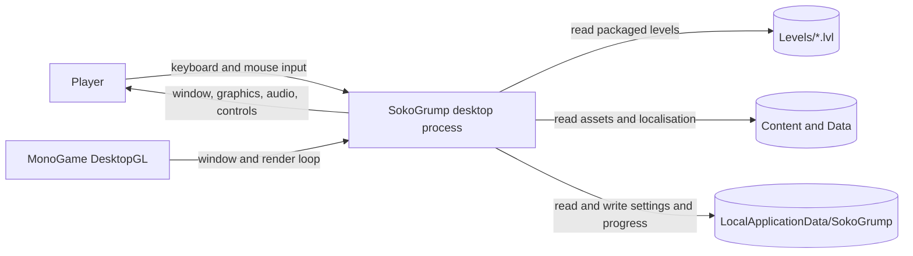
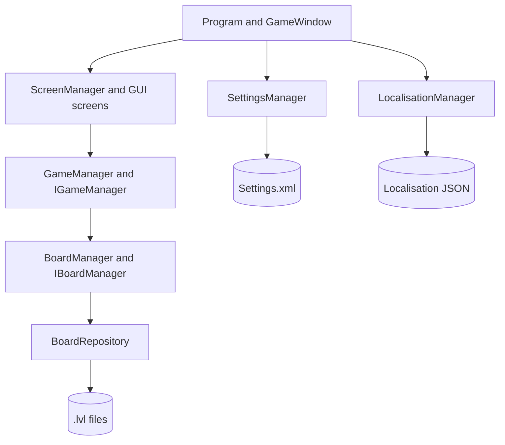
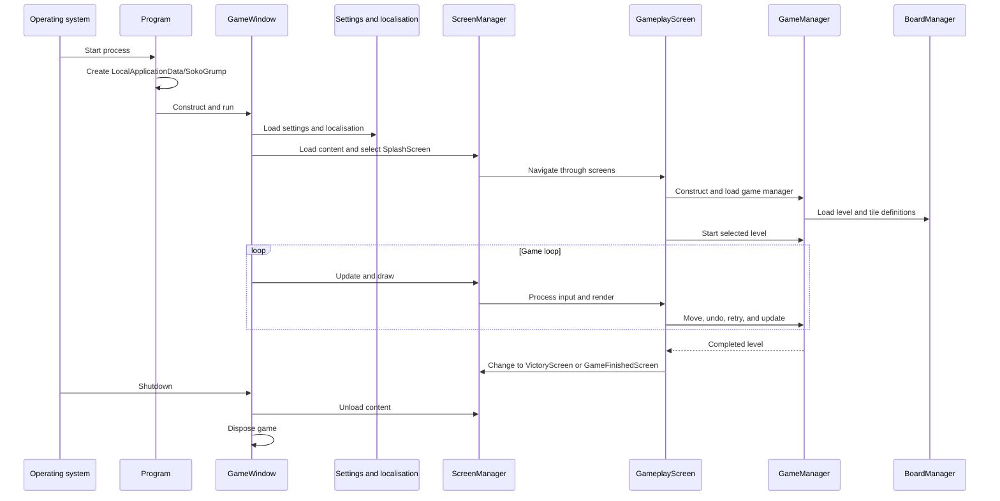
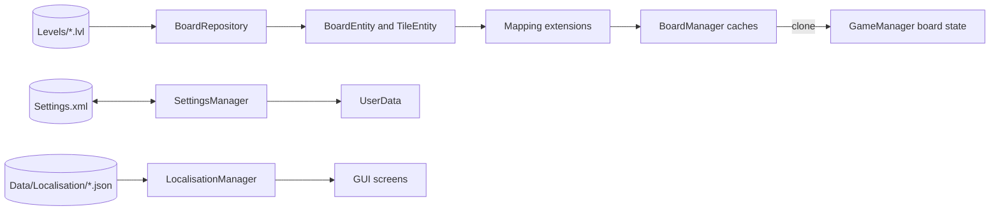
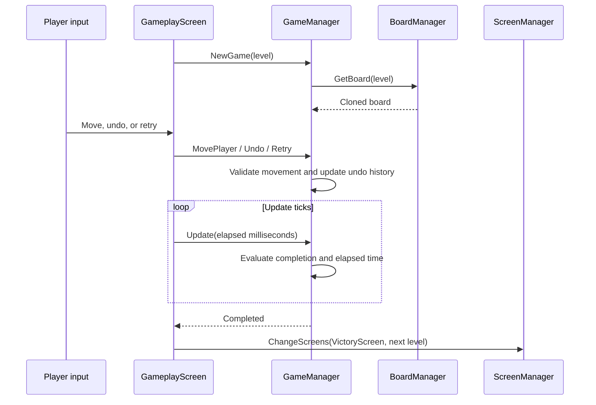
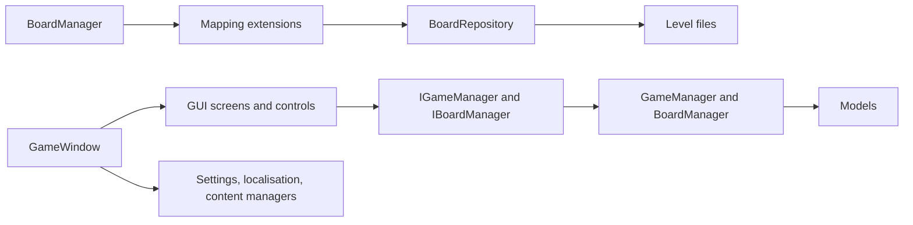

# SokoGrump Architecture

This document describes the current architecture of the cross-platform SokoGrump desktop game. It covers process startup, game-state ownership, asset and level loading, persistence, presentation, testing, and deployment boundaries.

## 📑 Table of Contents

- [Purpose](#-purpose)
- [System Context](#-system-context)
- [Architectural Style](#-architectural-style)
- [Runtime Flow](#-runtime-flow)
- [Components](#-components)
- [Architectural Areas](#-architectural-areas)
  - [Application Host](#application-host)
  - [Presentation](#presentation)
  - [Game Logic](#game-logic)
  - [Data And Configuration](#data-and-configuration)
  - [Content](#content)
  - [Tests](#tests)
- [Data Architecture](#-data-architecture)
- [Interfaces And Integrations](#-interfaces-and-integrations)
- [Key Flows](#-key-flows)
  - [Play And Complete A Level](#play-and-complete-a-level)
- [Cross-Cutting Concerns](#-cross-cutting-concerns)
  - [Error Handling](#error-handling)
  - [Configuration](#configuration)
  - [Resource Management](#resource-management)
- [Dependency Direction And Rules](#-dependency-direction-and-rules)
- [External Dependencies](#-external-dependencies)
- [Deployment And Operations](#-deployment-and-operations)
- [Compatibility Contracts](#-compatibility-contracts)
- [Testing And Verification](#-testing-and-verification)
- [Design Constraints](#-design-constraints)
- [Extension Points](#-extension-points)
  - [Game Manager](#game-manager)
  - [Board Manager](#board-manager)
- [Source Map](#-source-map)
- [Related Documentation](#-related-documentation)

## 🎯 Purpose

SokoGrump is a MonoGame DesktopGL Sokoban-style puzzle game. This document records the current implementation boundaries for contributors working on the host lifecycle, presentation, puzzle rules, content loading, persistence, and tests. It is a current-state description, not a target architecture.

## 🌐 System Context

The system boundary is the SokoGrump desktop process. A player supplies keyboard and mouse input. The process reads packaged levels, content assets, and localisation data; it writes user settings and progress to the local application-data directory; and it presents the game through a MonoGame window.



The principal external boundaries are:
- **Player:** Supplies movement, restart, undo, and menu input; receives rendered screens, counters, and feedback.
- **MonoGame DesktopGL:** Hosts the game loop, graphics device, window, sprite batch, and content pipeline integration.
- **Packaged files:** Levels, compiled content, fonts, audio, sprites, and localisation are read from the application installation.
- **Local application data:** `Settings.xml` stores settings and `UserData`, including the last level and selected language.

## 🏗️ Architectural Style

The game uses a single-process desktop client with a framework-driven lifecycle, screen-based presentation, and separated domain/data mapping. MonoGame calls the host lifecycle; the screen manager orchestrates presentation; game managers own puzzle state; repositories and mapping extensions translate file/data representations into domain models.



The principal architecture boundaries are:
- **Host:** Owns process startup, MonoGame lifecycle, shared framework managers, and orderly content load/unload.
- **Presentation:** Owns screens, controls, input events, and rendering composition; it invokes game-manager contracts rather than implementing puzzle rules.
- **Game logic:** Owns board state, player movement, crate pushing, completion, elapsed time, and undo snapshots.
- **Data access and mapping:** Owns level-file parsing and conversion between data objects and domain models.
- **Settings and localisation:** Owns user preferences, local persistence, language selection, and translated UI values.

## 🔄 Runtime Flow



The principal runtime sequence is:
1. `Program.Main` creates the user-data directory, constructs `GameWindow`, and enters the MonoGame loop.
2. `GameWindow.LoadContent` initialises graphics, content, settings, localisation, screen management, the FPS indicator, and cursor.
3. `ScreenManager` starts at `SplashScreen` and later presents menu or gameplay screens.
4. `GameplayScreen` creates a `GameManager`, loads boards and tiles, and starts the selected level.
5. Each update delegates input and elapsed time to the active screen and game manager; drawing delegates to the screen manager and shared overlays.
6. Completion changes screens and updates `UserData.LastLevel`; shutdown unloads screen, indicator, and cursor content before disposal.

## 🧩 Components

| Component | Responsibility | Principal Dependencies | Lifetime or Ownership |
|-----------|----------------|------------------------|-----------------------|
| `Program` | Process entry, user-data directory preparation, and game startup | `ApplicationPaths`, `GameWindow` | Process lifetime |
| `GameWindow` | MonoGame host lifecycle, shared managers, update, and draw | MonoGame, NuciXNA managers, `ScreenManager` | One instance per process |
| `ScreenManager` | Active screen selection, update, draw, and transitions | NuciXNA GUI, screen classes | Shared singleton owned by GUI framework |
| `GameplayScreen` | Gameplay controls, level progression, and screen-level persistence trigger | `IGameManager`, controls, settings, screen manager | One instance per gameplay screen |
| `GameManager` | Puzzle state, movement, crate pushing, completion, timing, and undo | `IBoardManager`, domain models | One instance per gameplay screen |
| `BoardManager` | Cached board and tile definitions; cloning for new games | `BoardRepository`, mapping extensions | One instance per game manager |
| `BoardRepository` | Reads fixed-grid `.lvl` files into data objects | `NuciDAL`, filesystem, `ApplicationPaths` | Created while board content loads |
| `SettingsManager` | Loads, updates, and saves graphics/audio/user settings | `NuciDAL`, graphics manager, local filesystem | Shared singleton |
| `LocalisationManager` | Selects and loads language data with English fallback | `NuciDAL`, settings, localisation files | Shared singleton |

## 🗂️ Architectural Areas

### Application Host

Paths:
- [`SokoGrump/Program.cs`](SokoGrump/Program.cs)
- [`SokoGrump/GameWindow.cs`](SokoGrump/GameWindow.cs)
- [`SokoGrump/Singleton.cs`](SokoGrump/Singleton.cs)

Responsibilities:
- Establish the process entry point and user-data directory.
- Compose the MonoGame host and shared managers.
- Own framework update, draw, load, unload, and disposal order.

Boundary rules:
- Host lifecycle code initialises infrastructure before screens use it.
- Shared managers are configured at load time and unloaded at shutdown.

### Presentation

Paths:
- [`SokoGrump/Gui/`](SokoGrump/Gui/)
- [`SokoGrump/Localisation/LocalisationManager.cs`](SokoGrump/Localisation/LocalisationManager.cs)

Responsibilities:
- Present menus, gameplay, victory, completion, settings, and splash screens.
- Convert control events and keyboard input into game-manager operations.
- Render the board and status information using NuciXNA GUI and graphics facilities.

Boundary rules:
- Screens own presentation and navigation decisions.
- Puzzle rules remain in `GameManager`, not in GUI controls.

### Game Logic

Paths:
- [`SokoGrump/GameLogic/`](SokoGrump/GameLogic/)
- [`SokoGrump/Models/`](SokoGrump/Models/)

Responsibilities:
- Represent boards, tiles, players, directions, and tile types.
- Apply legal movement and crate-pushing rules.
- Track elapsed time, move count, completion, and undo history.

Boundary rules:
- `GameManager` obtains boards and tiles through `IBoardManager`.
- Domain models are independent of screen rendering concerns.

### Data And Configuration

Paths:
- [`SokoGrump/DataAccess/`](SokoGrump/DataAccess/)
- [`SokoGrump/Settings/`](SokoGrump/Settings/)
- [`SokoGrump/Data/`](SokoGrump/Data/)
- [`SokoGrump/Levels/`](SokoGrump/Levels/)

Responsibilities:
- Parse level files and map data objects to domain models.
- Persist settings and user progress.
- Resolve installation-relative content and local application-data paths.

Boundary rules:
- File representations are translated at repository and mapping boundaries.
- Application settings are owned by `SettingsManager`; gameplay state is owned by `GameManager`.

### Content

Paths:
- [`SokoGrump/Content/`](SokoGrump/Content/)
- [`SokoGrump/Content/Content.mgcb`](SokoGrump/Content/Content.mgcb)

Responsibilities:
- Store and compile sprites, tiles, buttons, cursors, fonts, and audio.
- Provide runtime content through the MonoGame content manager.

Boundary rules:
- Asset names and content locations are consumed by presentation and data definitions.
- Content is loaded and unloaded through the host lifecycle.

### Tests

Paths:
- [`SokoGrump.UnitTests/`](SokoGrump.UnitTests/)
- [`SokoGrump.UnitTests/GameLogic/`](SokoGrump.UnitTests/GameLogic/)
- [`SokoGrump.UnitTests/Models/`](SokoGrump.UnitTests/Models/)

Responsibilities:
- Verify game-manager behaviour, mapping extensions, and core model behaviour.
- Exercise logic with test board helpers and mocked collaborators.

Boundary rules:
- The test project references the application project and accesses internals through the application project’s `InternalsVisibleTo` declaration.

## 💾 Data Architecture

Packaged levels are immutable runtime inputs. `BoardRepository` reads each fixed-size text grid, resolves numeric tile identifiers, records the player start location, and produces `BoardEntity` instances. Mapping extensions convert those entities into domain `Board` objects. `BoardManager` caches boards and tile prototypes, returning clones so each `GameManager` owns mutable gameplay state.

User settings and progress are mutable local state. `SettingsManager` serialises settings, graphics, audio, and `UserData` to `Settings.xml`; `GameplayScreen` updates `LastLevel` as levels are completed and saves settings when gameplay content unloads. Localisation JSON is read from the packaged `Data/Localisation` directory and selected using saved or system language candidates.



| Data or Store | Owner | Representation and Storage | Lifecycle or Consistency |
|---------------|-------|----------------------------|--------------------------|
| Level definitions | `BoardRepository` / `BoardManager` | Fixed-grid text files in [`SokoGrump/Levels/`](SokoGrump/Levels/) mapped to entities and domain models | Loaded during game-manager content load; cached until unload; source files are not modified during play |
| Gameplay state | `GameManager` | Mutable `Board`, `Player`, counters, and in-memory undo snapshots | Created for each gameplay screen; discarded on unload or screen change |
| Settings and progress | `SettingsManager` | XML at `ApplicationPaths.SettingsFile` under local application data | Loaded at startup; updated during runtime; saved on first run and gameplay unload |
| Localised UI data | `LocalisationManager` | JSON files under `ApplicationPaths.LocalisationDirectory` | Loaded once per process; selected language is retained in `UserData.Language` |

## 🔌 Interfaces And Integrations

| Interface or Integration | Direction | Contract | Owner | Failure Semantics |
|--------------------------|-----------|----------|-------|-------------------|
| MonoGame game lifecycle | Inbound | `Game.LoadContent`, `Update`, `Draw`, and `UnloadContent` overrides | `GameWindow` | Framework controls timing; failures are not translated by an application boundary |
| Keyboard and mouse input | Inbound | NuciXNA input and GUI events mapped to movement, retry, undo, and navigation | GUI screens and controls | Invalid or blocked moves are ignored by `GameManager`; inactive-window input is reset |
| Level files | Inbound | Numeric tile grids with identifiers matching `TileId` and fixed board dimensions | `BoardRepository` | Filesystem or format errors propagate from loading; no fallback level is defined |
| Settings XML | Bidirectional | XML serialisation of `SettingsManager` and nested settings/user data | `SettingsManager` | Missing file creates defaults; read/write failures propagate |
| Localisation JSON | Inbound | `LocalisationData` fields selected by saved/system language candidates | `LocalisationManager` | Missing candidates fall back to English data defaults; file read/parse failures propagate |
| Compiled MonoGame content | Inbound | Content names referenced by screens, controls, and tile definitions | `NuciContentManager` and host | Missing or invalid assets fail during content loading |

## 🔀 Key Flows

### Play And Complete A Level



`GameManager` is the authority for legal movement. A move can enter a walkable tile or push a crate only when the destination beyond the crate is in bounds and is a floor tile. Successful moves record a snapshot for undo and increment the player move count. Completion requires every target location to contain a crate-on-target tile. `GameplayScreen` owns the transition to the next level or the final completion screen.

## 🧵 Cross-Cutting Concerns

### Error Handling

The current boundaries primarily propagate filesystem, serialisation, content-loading, and invalid-level exceptions to the caller or framework. `GameManager` handles invalid movement as a no-op, and `Undo` does nothing when no history exists. `BoardRepository` contains a logging TODO and does not currently translate or record level-load failures.

### Configuration

| Configuration Area | Source | Responsibility | Override or Secret Policy |
|--------------------|--------|----------------|---------------------------|
| Graphics settings | `SettingsManager` serialised in `Settings.xml` | Fullscreen state and resolution | Loaded from local user data; no secret values |
| Audio settings | `SettingsManager` serialised in `Settings.xml` | User audio preferences | Loaded from local user data; no secret values |
| User progress and language | `UserData` in `Settings.xml` | Continue-game level and selected language | Saved locally; system culture is used only when language is unset |
| Installation paths | `ApplicationPaths` | Levels, data, localisation, and content roots | Derived from executable location; user data uses the operating system local application-data directory |

### Resource Management

`GameWindow` owns the top-level load and unload order. `ScreenManager`, the FPS indicator, and cursor release their content during `UnloadContent`; the desktop host disposes the `GameWindow` after `Run` returns. Board and tile caches are cleared by `BoardManager.UnloadContent`.

## 🧭 Dependency Direction And Rules

Stable domain contracts sit between presentation and mutable puzzle implementation. Presentation depends on `IGameManager`; `GameManager` depends on `IBoardManager`; board loading depends on repositories and mapping extensions; models do not depend on GUI screens.



The principal dependency rules are:
- Screens invoke game behaviour through `IGameManager`; they do not mutate board tiles directly.
- `GameManager` obtains boards and tile clones through `IBoardManager`.
- Repositories and mapping extensions own translation from files/data objects into domain models.
- Domain models and game rules do not depend on GUI rendering types.
- Shared singleton managers are configured by the host before screens consume them.
- New file formats should be isolated behind data-access or mapping boundaries rather than spread through game logic.

## 📦 External Dependencies

| Dependency | Responsibility | Integration Boundary | Architectural Consequence |
|------------|----------------|----------------------|---------------------------|
| `MonoGame.Framework.DesktopGL` | Desktop game loop, graphics, window, and content runtime | `GameWindow` and content pipeline | The application follows MonoGame lifecycle and DesktopGL platform constraints |
| `MonoGame.Content.Builder.Task` | Builds `.mgcb` content during the project build | `SokoGrump.csproj` and [`Content/Content.mgcb`](SokoGrump/Content/Content.mgcb) | Asset changes require content-pipeline-compatible build output |
| `NuciXNA.Gui`, `NuciXNA.Graphics`, `NuciXNA.Input`, `NuciXNA.Primitives` | Screen, control, rendering, input, and value-type infrastructure | Host and GUI areas | Presentation structure and input contracts follow NuciXNA APIs |
| `NuciXNA.DataAccess` and `NuciDAL` | Content/data helpers, repositories, and XML/JSON serialisation | `BoardRepository`, `SettingsManager`, and `LocalisationManager` | Persistence and repository implementations are coupled to these library contracts |
| .NET 10 | Runtime, filesystem, culture, serialisation support, and test host | All projects | Deployment requires a compatible .NET 10 environment |

## 🚀 Deployment And Operations

SokoGrump is deployed as one cross-platform DesktopGL executable with packaged content, levels, localisation files, fonts, and native platform libraries as required by the project. It has no server process, network API, or shared database. Runtime user state is stored per user under the operating system’s local application-data directory.

| Concern | Current Design | Architectural Consequence |
|---------|----------------|---------------------------|
| Process topology | One interactive desktop process | No horizontal scaling or server coordination model |
| Runtime state | In-memory gameplay state plus local XML settings | Progress is local to the user and installation environment |
| Content deployment | Build output includes compiled content and `.lvl`/data files | Missing packaged files prevent normal loading or presentation |
| Release packaging | `release.sh` delegates to an external maintainer deployment script | Release execution depends on the external script and its network availability |
| Platform support | MonoGame DesktopGL with platform-specific native libraries in the project | Packaging must preserve the native library appropriate to the target platform |

## 🛡️ Compatibility Contracts

| Contract | Owner | Invariant | Verification | Change Policy |
|----------|-------|-----------|--------------|---------------|
| Level file format | `BoardRepository` | Files contain the expected fixed grid and numeric `TileId` values; player start is encoded in the grid | Unit tests for mapping and manual play through packaged levels | Update parser and all affected level files together |
| Board dimensions | `GameDefines` and `BoardRepository` | Parsing and gameplay use the configured fixed width and height | Game-manager and mapping tests | A dimension change requires level, rendering, and test updates |
| Game-manager contract | `IGameManager` | Screens can load, update, start, move, retry, undo, and inspect completion state | `GameManagerTests` and gameplay verification | Preserve screen-facing semantics when changing implementation |
| Settings serialisation | `SettingsManager` | `Settings.xml` represents settings, graphics, audio, and `UserData` fields | Start-up, settings, and persistence checks | Preserve readable fields or provide an explicit migration |
| Content identifiers | Content names and tile `SpriteSheet` values | Referenced assets resolve through the MonoGame content manager | Build and manual rendering check | Rename assets and references together |

## ✅ Testing And Verification

The `SokoGrump.UnitTests` project verifies core models, board and tile mapping, and `GameManager` behaviour. Tests use NUnit and Moq; the application exposes internals to the test project. The repository does not currently provide automated rendering or end-to-end screen tests, so content loading and input workflows require manual verification.

Execute the principal automated verification with:

```bash
dotnet test SokoGrump.slnx
```

Build the application and content pipeline with:

```bash
dotnet build SokoGrump
```

Run the desktop client with:

```bash
dotnet run --project SokoGrump
```

## ⚠️ Design Constraints

- **Fixed board format:** Levels are parsed as fixed-size grids using numeric tile identifiers; malformed or incompatible files are not repaired at runtime.
- **Single-process state:** Gameplay, settings, and screen transitions are local to one process and one user; there is no synchronisation or multi-user persistence.
- **Framework lifecycle:** Loading, updating, drawing, and disposal follow MonoGame and NuciXNA lifecycle contracts.
- **Clone-based state isolation:** Board and tile definitions are cached and cloned for gameplay, so changes to the domain model do not automatically persist back to level sources.
- **Limited failure translation:** Most I/O, serialisation, and content failures propagate without structured logging or user-facing recovery.
- **Content coupling:** Screen and tile rendering refer to content asset names, so asset renames require coordinated code and content changes.

## 🔧 Extension Points

### Game Manager

1. Implement or revise `IGameManager` for a gameplay implementation.
2. Construct it at the gameplay-screen composition boundary.
3. Add or update game-manager tests for movement, completion, timing, and undo contracts.

The screen-facing contract must preserve level selection, update timing, movement direction, retry, undo availability, and completion semantics.

### Board Manager

1. Implement or revise `IBoardManager` for board and tile provisioning.
2. Register or construct it within `GameManager` or its test seam.
3. Add mapping and repository verification for the supplied board representation.

Board implementations must provide independent clones for mutable gameplay state and retain the tile identifiers and types expected by `GameManager`.

## 🗺️ Source Map

| Area | Repository paths |
|------|------------------|
| Host and lifecycle | [`SokoGrump/Program.cs`](SokoGrump/Program.cs), [`SokoGrump/GameWindow.cs`](SokoGrump/GameWindow.cs) |
| Presentation | [`SokoGrump/Gui/`](SokoGrump/Gui/), [`SokoGrump/Localisation/`](SokoGrump/Localisation/) |
| Puzzle domain | [`SokoGrump/GameLogic/`](SokoGrump/GameLogic/), [`SokoGrump/Models/`](SokoGrump/Models/) |
| Persistence and paths | [`SokoGrump/DataAccess/`](SokoGrump/DataAccess/), [`SokoGrump/Settings/`](SokoGrump/Settings/) |
| Runtime content and data | [`SokoGrump/Content/`](SokoGrump/Content/), [`SokoGrump/Data/`](SokoGrump/Data/), [`SokoGrump/Levels/`](SokoGrump/Levels/) |
| Automated tests | [`SokoGrump.UnitTests/`](SokoGrump.UnitTests/) |
| Build and release | [`SokoGrump.slnx`](SokoGrump.slnx), [`SokoGrump/SokoGrump.csproj`](SokoGrump/SokoGrump.csproj), [`release.sh`](release.sh) |

## 📚 Related Documentation

- [`README.md`](README.md): project overview, gameplay, development prerequisites, commands, and release instructions.
