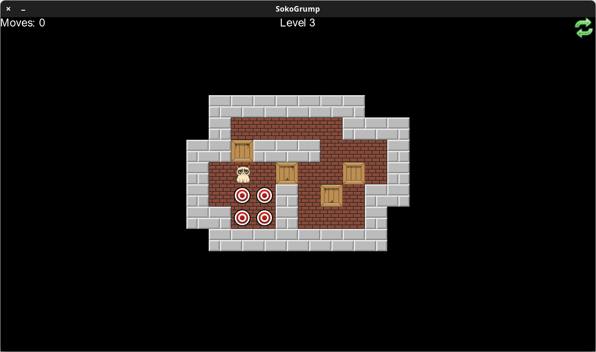

[](https://hmlendea.go.ro/fund.html) [](https://github.com/hmlendea/sokogrump/releases/latest) [](https://github.com/hmlendea/sokogrump/actions/workflows/dotnet.yml) [](https://gnu.org/licenses/gpl-3.0)

# SokoGrump

SokoGrump is a cross-platform Sokoban-style puzzle game built with C#, .NET 10, and MonoGame DesktopGL. It reworks the classic BoxWorld formula into a compact crate-pushing puzzle game starring Grumpy Cat.

The game includes 100 hand-authored levels with progressively harder layouts. Your objective is to push every crate onto a target tile without cornering yourself or blocking the board.



## Features

- 100 included puzzle levels
- Keyboard-driven gameplay with mouse support for menus
- Move counter and current-level display during play
- Continue Game support through saved progress
- Fullscreen toggle in the settings menu
- Cross-platform DesktopGL build

## Gameplay

Each level is played on a fixed grid. The player can move freely, but crates can only be pushed, never pulled. A level is complete when every target tile is occupied by a crate.

### Controls

- `W`, `A`, `S`, `D` or arrow keys: move
- `R`: restart the current level
- Mouse: navigate menus and use the on-screen retry button

## Installation

### Flatpak

[](https://flathub.org/apps/details/ro.go.hmlendea.SokoGrump)

### Prebuilt releases

Download the latest packaged build from the [GitHub releases page](https://github.com/hmlendea/sokogrump/releases/latest).

## Running From Source

### Requirements

- .NET target framework: `net10.0`
- MonoGame DesktopGL (or compatible runtime)
- NuciXNA (restored automatically from NuGet)

The CI workflow installs `dotnet-mgcb` and TrueType core fonts before building on Ubuntu. If your local environment is missing MonoGame content build tooling or required fonts, install those before building.

### Build

```bash
dotnet build
```

### Run

```bash
dotnet run
```

The game stores settings and saved progress in the local application data directory under `SokoGrump`.

## Project Structure

- `Content/`: fonts, sprites, cursors, audio, and content pipeline assets
- `DataAccess/`: level loading and storage-facing models
- `GameLogic/`: board handling and gameplay rules
- `Gui/`: screens, controls, and rendering helpers
- `Levels/`: bundled `.lvl` files for all shipped stages
- `Models/`: domain objects such as boards, tiles, and the player
- `Settings/`: graphics, audio, and saved-user-data management

## Contributing

Contributions are welcome.

Please:

- keep changes cross-platform
- keep pull requests focused and consistent with existing style
- update documentation when behaviour changes
- add or update tests for new behaviour

# Links
- [Latest release](https://github.com/hmlendea/sokogrump/releases/latest)
- [FlatHub release](https://flathub.org/apps/details/ro.go.hmlendea.SokoGrump)
- [FlatHub repository](https://github.com/flathub/ro.go.hmlendea.SokoGrump)

## License

Licensed under the GNU General Public License v3.0 or later.
See [LICENSE](./LICENSE) for details.