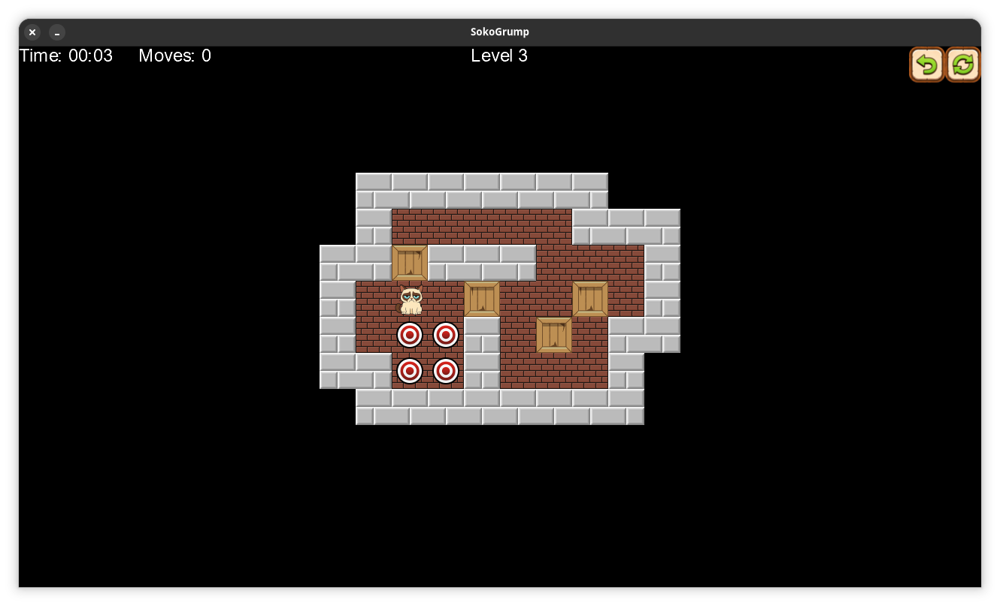

[](https://hmlendea.go.ro/funding)
[](https://github.com/hmlendea/sokogrump/releases/latest)
[](https://github.com/hmlendea/sokogrump/actions/workflows/dotnet.yml)
[](https://gnu.org/licenses/gpl-3.0)

# SokoGrump

SokoGrump is a cross-platform Sokoban-style puzzle game built with C#, .NET 10, and MonoGame DesktopGL. It reworks the classic BoxWorld formula into a compact crate-pushing puzzle game starring Grumpy Cat.

The game includes 100 hand-authored levels with progressively harder layouts. Your objective is to push every crate onto a target tile without cornering yourself or blocking the board.



## Features

- 100 included puzzle levels
- Keyboard-driven gameplay with mouse support for menus
- Move counter and current-level display during play
- Continue Game support through saved progress
- Fullscreen toggle in the settings menu
- Cross-platform DesktopGL build

## Gameplay

Each level is played on a fixed grid. The player can move freely, but crates can only be pushed, never pulled. A level is complete when every target tile is occupied by a crate.

### Controls

- `W`, `A`, `S`, `D` or arrow keys: move
- `R`: restart the current level
- Mouse: navigate menus and use the on-screen retry button

## Installation

### Flatpak

[](https://flathub.org/apps/details/ro.go.hmlendea.SokoGrump)

### Prebuilt releases

Download the latest packaged build from the [GitHub releases page](https://github.com/hmlendea/sokogrump/releases/latest).

## Running From Source

### Requirements

- [.NET 10 SDK](https://dotnet.microsoft.com/download)
- MonoGame content build tools (`dotnet-mgcb`) — required to rebuild game assets
- TrueType core fonts — required for font rendering on Linux (`fonts-freefont-ttf` or equivalent)

All NuGet dependencies (MonoGame, NuciXNA) are restored automatically by `dotnet restore`.

On Ubuntu the CI workflow installs the missing tools with:

### Build

```bash
dotnet build
```

### Run

```bash
dotnet run
```

The game stores settings and saved progress in the local application data directory under `SokoGrump`.

### Test

```bash
dotnet test
```

### Release

The repository includes `release.sh`, which delegates to the upstream deployment script used by the project maintainer.

```bash
bash ./release.sh 1.0.0
```

This script downloads and executes an external release helper from `https://raw.githubusercontent.com/hmlendea/deployment-scripts/master/release/dotnet/10.0.sh`.

**Note:** Piping into `bash` is an intensely controversial topic. Please review any external scripts before running them in your environment!

## Project Structure

The solution contains two projects:

- **SokoGrump** — The game itself
- **SokoGrump.UnitTests** — Unit tests covering game managers, board/tile mapping, and core models

Key directories inside `SokoGrump/`:

| Directory | Purpose |
|-----------|---------|
| `Content/` | Game assets: sprites, tiles, cursors, fonts, audio, and MonoGame content builder files |
| `Data/` | Localisation resource files |
| `DataAccess/` | Data persistence layer — repositories and data objects for boards and settings |
| `GameLogic/` | Core puzzle logic — game manager, board mapping, move and undo handling |
| `Gui/` | All UI — screens (title, gameplay, victory, game-finished, splash), controls, and sprite effects |
| `Levels/` | 100 hand-authored puzzle levels (`0.lvl` – `99.lvl`) |
| `Localisation/` | Localisation manager for multi-language text |
| `Models/` | Core entity models: `Board`, `Player`, `Tile`, `TileType`, `TileId`, `MovementDirection`, `DirectionDelta` |
| `Settings/` | Application-wide configuration: paths, graphics, audio, game defines, and user data |

### Dependencies

| Package | Purpose |
|---------|---------|
| `MonoGame.Framework.DesktopGL` | Cross-platform game framework |
| `MonoGame.Content.Builder.Task` | Compiles game assets at build time |
| `NuciXNA.DataAccess` | Content loading and data access utilities |
| `NuciXNA.Graphics` | Graphics manager and sprite drawing helpers |
| `NuciXNA.Gui` | GUI controls, screen manager, and cursor |
| `NuciXNA.Input` | Keyboard and mouse input manager |
| `NuciXNA.Primitives` | Reusable value types: `Point2D`, `Size2D`, `Scale2D`, `Colour` |
| `NuciDAL` | Generic data-access-layer base classes |

## Contributing

Contributions are welcome.

Please:

- keep changes cross-platform
- keep pull requests focused and consistent with existing style
- update documentation when behaviour changes
- add or update tests for new behaviour

# Links
- [Latest release](https://github.com/hmlendea/sokogrump/releases/latest)
- [FlatHub release](https://flathub.org/apps/details/ro.go.hmlendea.SokoGrump)
- [FlatHub repository](https://github.com/flathub/ro.go.hmlendea.SokoGrump)

## License

Licensed under the GNU General Public License v3.0 or later.
See [LICENSE](./LICENSE) for details.