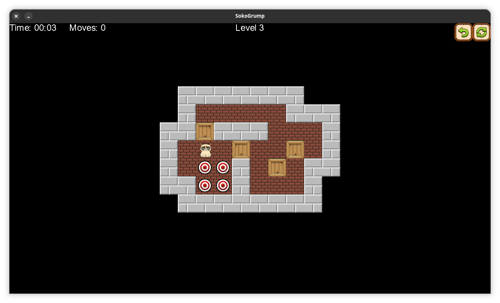

[](https://hmlendea.go.ro/funding)
[](https://github.com/hmlendea/sokogrump/releases/latest)
[](https://github.com/hmlendea/sokogrump/actions/workflows/dotnet.yml)
[](https://github.com/hmlendea/sokogrump/blob/master/LICENSE)

# SokoGrump

SokoGrump is a cross-platform Sokoban-style puzzle game built with C#, .NET 10, and MonoGame DesktopGL. It reworks the classic BoxWorld formula into a compact crate-pushing puzzle game starring Grumpy Cat.

The game includes 100 hand-authored levels with progressively harder layouts. Your objective is to push every crate onto a target tile without cornering yourself or blocking the board.



## 📑 Table of Contents

- [Capabilities](#-capabilities)
- [Usage](#-usage)
- [System Requirements](#-system-requirements)
- [Installation](#-installation)
- [Localisation](#-localisation)
- [Development](#-development)
- [Dependencies](#-dependencies)
- [GitHub Actions](#-github-actions)
- [Project Structure](#-project-structure)
- [Architecture](#-architecture)
- [Privacy and Data](#-privacy-and-data)
- [Contributing](#-contributing)
- [Security](#-security)
- [License](#-license)

## ✨ Capabilities

- 100 included puzzle levels
- Keyboard-driven gameplay with mouse support for menus
- Undo last move support
- Elapsed time, move counter, and level display during play
- Bilingual interface (English and Romanian)
- Continue Game support through saved progress
- Fullscreen toggle in the settings menu
- Cross-platform DesktopGL build

## 🚀 Usage

Each level is played on a fixed grid. The player can move freely, but crates can only be pushed, never pulled. A level is complete when every target tile is occupied by a crate.

### Controls

- `W`, `A`, `S`, `D` or arrow keys: move
- `R`: restart the current level
- `U`: undo last move
- Mouse: navigate menus and use the on-screen retry and undo buttons

## 🖥️ System Requirements

| Component | Minimum | Recommended |
|-----------|---------|-------------|
| OS | Linux, macOS, Windows | Linux, macOS, Windows |
| .NET Runtime | .NET 10 Desktop Runtime | .NET 10 Desktop Runtime |
| GPU | OpenGL 3.3 compatible | OpenGL 3.3 compatible |
| Disk Space | ~50 MB | ~50 MB |

## 📦 Installation

### Flatpak

[](https://flathub.org/apps/details/ro.go.hmlendea.SokoGrump)

```bash
flatpak install flathub ro.go.hmlendea.SokoGrump
```

### GitHub Releases

[](https://github.com/hmlendea/sokogrump/releases)

Download the latest packaged build from the [GitHub releases page](https://github.com/hmlendea/sokogrump/releases/latest).

## 🌍 Localisation

| Language | Locale | Status   |
|----------|--------|----------|
| English  | `en`   | Complete |
| Romanian | `ro`   | Complete |

## 🛠️ Development

### Requirements

- [.NET 10 SDK](https://dotnet.microsoft.com/download/dotnet/10.0)
- MonoGame content build tools (`dotnet-mgcb`) - required to rebuild game assets
- TrueType core fonts - required for font rendering on Linux (`fonts-freefont-ttf` or equivalent)

### Setup

```bash
git clone https://github.com/hmlendea/sokogrump.git
cd sokogrump
dotnet restore
dotnet tool install --global dotnet-mgcb
```

### Build

```bash
dotnet build SokoGrump
```

### Run

```bash
dotnet run --project SokoGrump
```

The game stores settings and saved progress in the local application data directory under `SokoGrump`.

### Test

```bash
dotnet test SokoGrump.slnx
```

### Release

The repository includes `release.sh`, which delegates to the upstream deployment script used by the project maintainer.

```bash
bash ./release.sh 1.0.0
```

This script downloads and executes an external release helper from `https://raw.githubusercontent.com/hmlendea/deployment-scripts/master/release/dotnet/10.0.sh`.

**Note:** Piping into `bash` is an intensely controversial topic. Please review any external scripts before running them in your environment!

## 📦 Dependencies

| Package | Version | Scope | Purpose |
|---------|---------|-------|---------|
| `MonoGame.Framework.DesktopGL` | 3.8.4 | Runtime | Cross-platform game framework |
| `MonoGame.Content.Builder.Task` | 3.8.4 | Build | Compiles game assets at build time |
| `NuciXNA.DataAccess` | 4.0.3 | Runtime | Content loading and data access utilities |
| `NuciXNA.Graphics` | 2.2.4 | Runtime | Graphics manager and sprite drawing helpers |
| `NuciXNA.Gui` | 3.4.1 | Runtime | GUI controls, screen manager, and cursor |
| `NuciXNA.Input` | 2.1.1 | Runtime | Keyboard and mouse input manager |
| `NuciXNA.Primitives` | 2.1.7 | Runtime | Reusable value types: `Point2D`, `Size2D`, `Scale2D`, `Colour` |
| `NuciDAL` | 3.1.1 | Runtime | Generic data-access-layer base classes |

## ⚙️ GitHub Actions

| Workflow | Purpose | What it does |
|----------|---------|--------------|
| [ dotnet.yml ](https://github.com/hmlendea/sokogrump/blob/master/.github/workflows/dotnet.yml) | Build and test | Restores dependencies, builds the solution, runs unit tests on Ubuntu |

## 🗂️ Project Structure

The solution contains two projects:

- **SokoGrump**: The game itself
- **SokoGrump.UnitTests**: Unit tests covering game managers, board/tile mapping, and core models

### Directories

| Directory | Purpose |
|-----------|---------|
| `Content/` | Game assets: sprites, tiles, cursors, fonts, audio, and MonoGame content builder files |
| `Data/` | Localisation resource files |
| `DataAccess/` | Data persistence layer - repositories and data objects for boards and settings |
| `GameLogic/` | Core puzzle logic - game manager, board mapping, move and undo handling |
| `Gui/` | All UI - screens (title, gameplay, victory, game-finished, splash), controls, and sprite effects |
| `Levels/` | 100 hand-authored puzzle levels (`0.lvl` to `99.lvl`) |
| `Localisation/` | Localisation manager for multi-language text |
| `Models/` | Core entity models: `Board`, `Player`, `Tile`, `TileType`, `TileId`, `MovementDirection`, `DirectionDelta` |
| `Settings/` | Application-wide configuration: paths, graphics, audio, game defines, and user data |

## 🏗️ Architecture

See the [ARCHITECTURE.md](ARCHITECTURE.md) for the system context, principal components, runtime flows, ownership boundaries, dependencies, constraints, and extension points.

See the [docs/](docs/) for focused implementation documentation covering architecture, runtime flows, gameplay rules, data and content formats, and development verification.

## 🛡️ Privacy and Data

For the detailed description of how the application handles privacy and personal data, see [PRIVACY.md](./PRIVACY.md).

### Data Locations

| Platform or Scope | Location | Contents |
|-------------------|----------|----------|
| Windows | `%LOCALAPPDATA%\SokoGrump\Settings.xml` | Language, graphics, audio settings, last completed level |
| Linux/macOS | `~/.local/share/SokoGrump/Settings.xml` | Language, graphics, audio settings, last completed level |
| Windows | `%LOCALAPPDATA%\SokoGrump\Logs\` | Log files (directory exists, no current writers) |
| Linux/macOS | `~/.local/share/SokoGrump/Logs/` | Log files (directory exists, no current writers) |

## 🤝 Contributing

You are welcome to submit any suggestion, feedback, or modification to this project.

When doing so, please:
- Maintain cross-platform compatibility
- Submit focused pull requests that conform to the existing code style
- Maintain your branch synchronised with `master`
- Revise the documentation when functionality changes
- Properly test all modifications, including edge cases and error conditions
- Add tests for additional or modified functionality
- Raise a new [issue](https://github.com/hmlendea/sokogrump/issues) for problems or suggestions

See the [contributing guidelines](./CONTRIBUTING.md) for details on how to report issues, suggest enhancements, and submit changes.

## 🔒 Security

For information on reporting security vulnerabilities, see [SECURITY.md](./SECURITY.md).

## 💝 Project Engagement

Discovered a problem or have a suggestion? [Open an issue](https://github.com/hmlendea/sokogrump/issues)!

If you find this project useful, consider [funding it](https://hmlendea.go.ro/funding) or starring ⭐️ it on GitHub!

[](https://hmlendea.go.ro/funding)

## 📄 License

This project is being distributed under the `GNU General Public License v3.0` or later.
See [LICENSE](./LICENSE) for further information.
