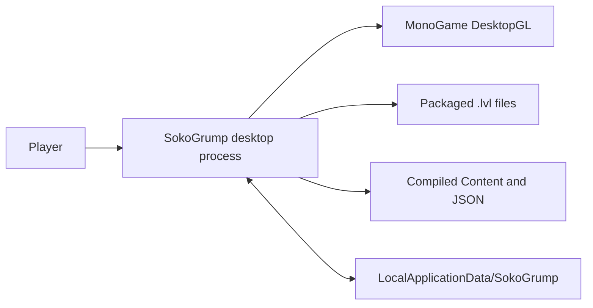
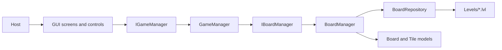

# Architecture

## System Boundary

The process is a desktop game hosted by MonoGame. The player supplies keyboard and mouse input. The process reads packaged levels and content, renders a window, and writes local settings and progress.

There is no remote service boundary. All gameplay state is in memory and belongs to the current process.

## Layers And Ownership

| Area | Main location | Owns | Does not own |
| --- | --- | --- | --- |
| Host | [Program.cs](../SokoGrump/Program.cs), [GameWindow.cs](../SokoGrump/GameWindow.cs) | Process startup, MonoGame lifecycle, shared framework managers, update/draw order | Puzzle rules or screen-specific state |
| Presentation | [Gui](../SokoGrump/Gui/), [LocalisationManager.cs](../SokoGrump/Localisation/LocalisationManager.cs) | Screens, controls, input translation, drawing, navigation | Legal movement, crate state, completion calculation |
| Game logic | [GameManagers](../SokoGrump/GameLogic/GameManagers/), [Models](../SokoGrump/Models/) | Mutable board state, player state, movement, push, undo, elapsed time, completion | Rendering, file paths, screen transitions |
| Data access | [DataAccess](../SokoGrump/DataAccess/), [Mapping](../SokoGrump/GameLogic/Mapping/) | Level-file reads, data objects, entity/domain conversion | Gameplay mutation and presentation |
| Settings | [Settings](../SokoGrump/Settings/) | Graphics preferences, audio settings, language, last-level progress | Board state and level parsing |
| Content | [Content](../SokoGrump/Content/), [Content.mgcb](../SokoGrump/Content/Content.mgcb) | Compiled sprites, fonts, audio, buttons, cursors, and effects | Runtime puzzle decisions |

## Dependency Direction

The important contracts are [IGameManager.cs](../SokoGrump/GameLogic/GameManagers/IGameManager.cs) and [IBoardManager.cs](../SokoGrump/GameLogic/GameManagers/IBoardManager.cs). Screens call the game contract. `GameManager` requests cloned boards and tile prototypes through the board contract. Models do not depend on GUI types.

## Principal Components

- [GameWindow.cs](../SokoGrump/GameWindow.cs) configures graphics, content, settings, localisation, screens, FPS display, and cursor. It owns framework update, draw, unload, and disposal order.
- [ScreenManager](../SokoGrump/Gui/Screens/) selects the active screen through the NuciXNA GUI framework.
- [GameplayScreen.cs](../SokoGrump/Gui/Screens/GameplayScreen.cs) composes a `GameManager`, board control, information bar, retry button, and undo button. It also decides the next screen after completion.
- [GameManager.cs](../SokoGrump/GameLogic/GameManagers/GameManager.cs) is the authority for legal movement and mutable puzzle state.
- [BoardManager.cs](../SokoGrump/GameLogic/GameManagers/BoardManager.cs) loads every level and tile prototype once per gameplay manager, then returns clones.
- [BoardRepository.cs](../SokoGrump/DataAccess/Repositories/BoardRepository.cs) parses fixed-grid text files into [BoardEntity.cs](../SokoGrump/DataAccess/DataObjects/BoardEntity.cs) and [TileEntity.cs](../SokoGrump/DataAccess/DataObjects/TileEntity.cs).
- [SettingsManager.cs](../SokoGrump/Settings/SettingsManager.cs) serialises preferences and user data to XML.
- [LocalisationManager.cs](../SokoGrump/Localisation/LocalisationManager.cs) selects a JSON language file and exposes translated labels to screens.

## State Ownership

`BoardManager` caches immutable-in-practice level definitions and tile prototypes. `GetBoard` and `GetTile` clone before returning. `GameManager.NewGame` then normalises encoded target states into gameplay states: `EmptyTarget` becomes `Floor`, and `CrateOnTarget` becomes `CrateOnFloor`. The target coordinate list remains on the board, so presentation and completion can still identify target locations.

`GameplayScreen` owns screen navigation and writes `UserData.LastLevel` when a level completes. `SettingsManager` persists that value when content unloads. A finished run sets `LastLevel` to zero; a completed non-final level sets it to the next level id.

## Constraints And Risks

- Level parsing assumes every file has at least 14 rows of at least 16 numeric characters. It does not validate shape or tile values before indexing.
- [BoardRepository.cs](../SokoGrump/DataAccess/Repositories/BoardRepository.cs) enumerates every file returned by `Directory.GetFiles`; non-level files in the levels directory can therefore affect loading.
- Most filesystem, serialisation, and content errors propagate to the framework. There is a logging TODO in the repository.
- GUI animation delays the actual model mutation: [GuiGameBoard.cs](../SokoGrump/Gui/Controls/GuiGameBoard.cs) calls `GameManager.MovePlayer` after the player movement effect completes, and calls `Undo` after the undo animation completes.
- Content names are string contracts. Renaming an asset requires coordinated changes in content configuration and source references.
- The board is fixed at 16 columns by 14 rows through [GameDefines.cs](../SokoGrump/Settings/GameDefines.cs).

## Extension Boundaries

Change [IGameManager.cs](../SokoGrump/GameLogic/GameManagers/IGameManager.cs) only with corresponding screen and test updates. Change board formats behind [BoardRepository.cs](../SokoGrump/DataAccess/Repositories/BoardRepository.cs) and its mapping extensions. Preserve clone isolation: gameplay must not mutate cached definitions. Add tests in [SokoGrump.UnitTests](../SokoGrump.UnitTests/) for every changed state transition.