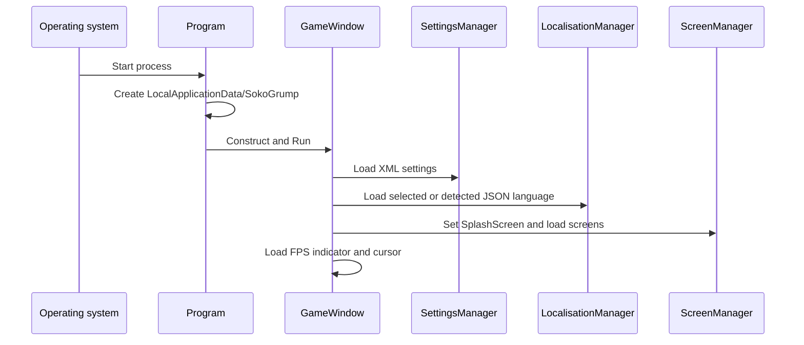
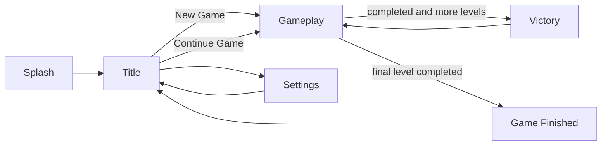

# Runtime Flows

## Process Startup

[Program.cs](../SokoGrump/Program.cs) creates the user-data directory before constructing [GameWindow.cs](../SokoGrump/GameWindow.cs). `GameWindow.LoadContent` creates the sprite batch, assigns shared graphics/content managers, loads settings and localisation, starts the screen manager at [SplashScreen.cs](../SokoGrump/Gui/Screens/SplashScreen.cs), and loads overlays.

## Screen Navigation

The splash screen advances after its delay or on input. The title screen creates a Continue Game link only when `LastLevel > 0`; New Game passes level `0`. Settings changes fullscreen state and returns to the title screen. Victory waits one second, then advances to the level id supplied by `GameplayScreen`. Game Finished waits five seconds or input, then returns to the title screen.

The screen implementations are in [Gui/Screens](../SokoGrump/Gui/Screens/): `SplashScreen`, `TitleScreen`, `GameplayScreen`, `SettingsScreen`, `VictoryScreen`, and `GameFinishedScreen`.

## Gameplay Composition

[GameplayScreen.DoLoadContent](../SokoGrump/Gui/Screens/GameplayScreen.cs) constructs a concrete `GameManager`, loads its `BoardManager`, and starts the requested level. It then registers:

- [GuiGameBoard.cs](../SokoGrump/Gui/Controls/GuiGameBoard.cs) for board rendering and keyboard movement.
- [GuiInfoBar.cs](../SokoGrump/Gui/Controls/GuiInfoBar.cs) for level, time, and move information.
- Retry and undo [GuiButton.cs](../SokoGrump/Gui/Controls/GuiButton.cs) controls.

The screen update calls `GameManager.Update` every tick. On completion it chooses Victory or Game Finished and updates `LastLevel`. On gameplay unload it unloads the game manager and saves settings.

## Input And Model Timing

The board control filters movement while a player animation is active. For a valid direction it starts player movement and, for a push, a separate crate movement effect. When the player effect ends, it commits `GameManager.MovePlayer`. This keeps model state aligned with the end of the visual move.

Undo follows the same pattern. The board control asks `PeekUndo`, animates the player and optional crate backwards, then calls `GameManager.Undo` when the player effect ends. The game manager therefore remains the authority for state restoration while the control owns animation timing.

At the host level, [GameWindow.Update](../SokoGrump/GameWindow.cs) applies settings, updates the active screen, updates input only while the window is active, and updates the FPS indicator and cursor. Inactive windows reset input states each tick; the source marks this as a temporary behaviour.

## Rendering

`GameWindow.Draw` clears to black, begins one sprite batch, draws the active screen through `ScreenManager`, then draws the FPS indicator and cursor. `GuiGameBoard` draws the fixed grid, target overlays, player, and active crate animation. Sprite-sheet effects select tile, crate, and player variants using board position, tile identity, and crate variation.

## Completion And Persistence

Completion is detected during the gameplay screen's update after `GameManager.Update` evaluates every target coordinate. The next-level file check uses `ApplicationPaths.LevelsDirectory` and the next numeric id. The setting is not written at that instant; it is persisted when the gameplay screen unloads through `SettingsManager.SaveContent`.

## Shutdown

When the MonoGame loop ends, `GameWindow.UnloadContent` unloads the active screen manager, FPS indicator, and cursor. The game object is then disposed by the framework/host lifecycle. Board caches are cleared when `GameplayScreen` unloads its game manager.